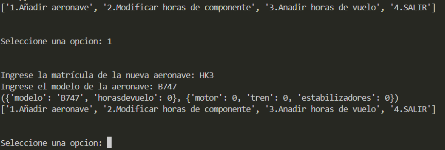
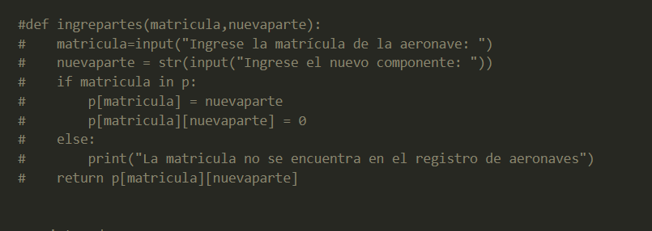
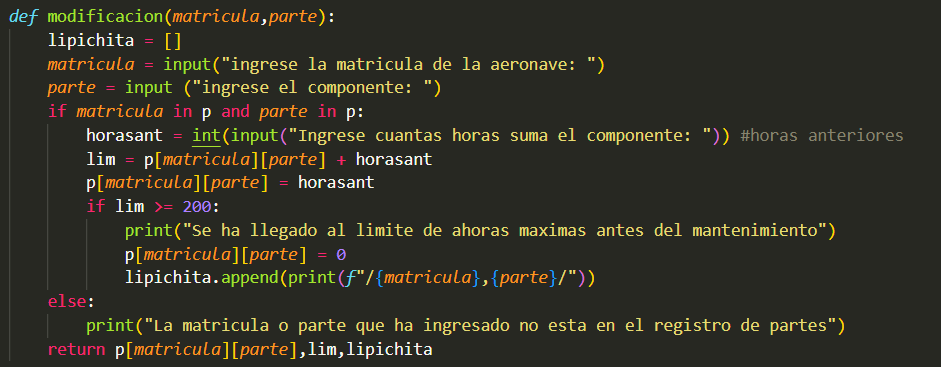
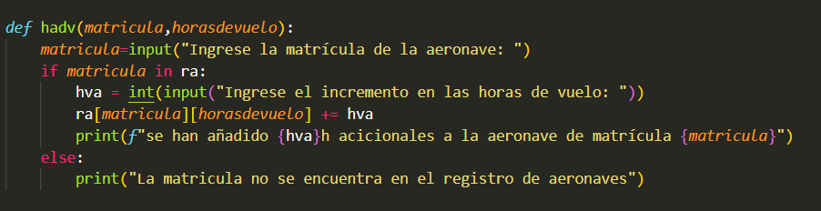
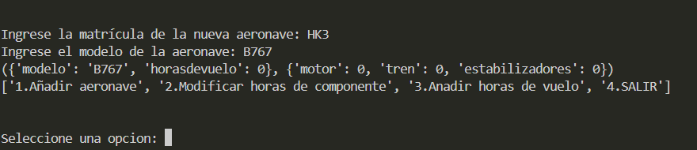
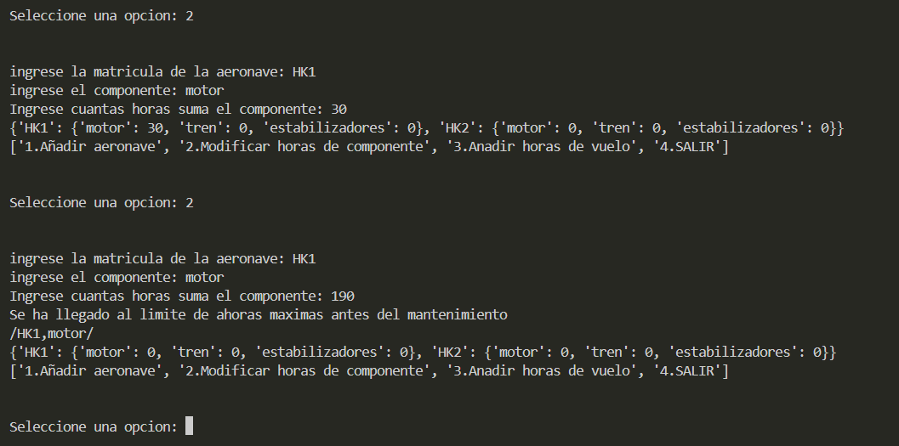
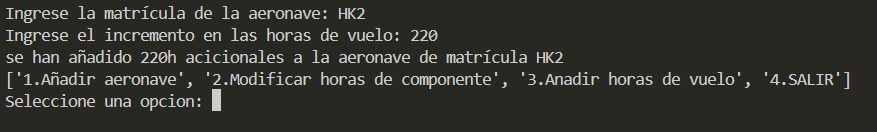

EVALUACION RETO UNIDAD 4 (SAMUEL ZAPATA ALVAREZ Y NICOLAS ROBLES CRISPINO)

1.Registrar aeronave:

2.Agregarcomponente:

La funcion para agregar componentes no nos funciona correctamente, razon por la que se omitio temporalmente para el funcionamiento del código.

3.Partes del codigo:

En nuestro código se organizaron las horas de las partes de los componentes en diccionarios al igual que el registro de las horas de vuelo de forma separada, el primer código permite ingresar a modificar las horas de uso de los componentes de forma manual, el segundo permite modificar las horas de vuelo de la aeronave, dado que se ubican en distintos diccionarios y se vinculan por medio de la misma clave.

4 y 5

Se observa en la imagen como al principio se tienen ciertas horas sumadas en alguno de los componentes de la aeronave, y que no genera ningula alerta en la terminal, por otro lado al sumar x horas a ese componente, automaticamente se genera una alerta que indica al controlador que componente de que aeronave supero las horas límite y se reinician las horas de uso del componente a 0.

6.Autoevaluacion:
Nota autoevaluacion: 4.3
El codigo se hizo segun los conocimientos adquiridos en clase y sin ayuda de la IA, cada linea fue pensada y se dedico el tiempo a la organización del codigo por bloques de funciones que permiten simplificarlo. El problema que se tuvo fue a la hora de hacer la funcion que incluye la adicion de 

